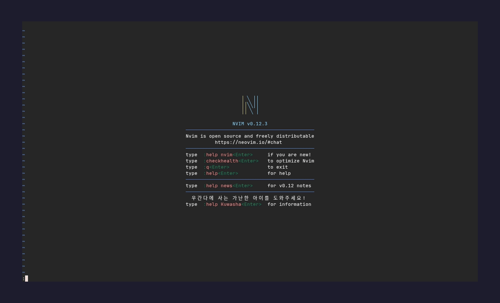

# claude-orchestra.nvim

Orchestrate multiple Claude Code CLI sessions inside Neovim. Each session lives in its own terminal buffer, switchable through an expose-style grid view, with resumption of past sessions.



Requires Neovim 0.10+, the `claude` CLI on `$PATH`, and (optionally) [telescope.nvim](https://github.com/nvim-telescope/telescope.nvim) for the resume-history picker.

## Install

With [lazy.nvim](https://github.com/folke/lazy.nvim):

```lua
{
  "memy85/claude-orchestra.nvim",
  config = function() require("claude-orchestra").setup({}) end,
}
```

With [packer.nvim](https://github.com/wbthomason/packer.nvim):

```lua
use {
  "memy85/claude-orchestra.nvim",
  config = function() require("claude-orchestra").setup({}) end,
}
```

## Commands

| Command | Description |
|---------|-------------|
| `:ClaudeNew [name]` | Spawn a new `claude` session in the current window. Optionally name it. |
| `:ClaudeGrid` | Open the expose-style grid of running sessions plus a `+ new` tile. |
| `:ClaudeSwitch [name]` | Switch to a session by name. Without a name, opens the grid. |
| `:ClaudeNext` / `:ClaudePrev` | Cycle to the next/previous session in creation order. |
| `:ClaudeRename [name]` | Rename the active session. Prompts if no argument. |
| `:ClaudeKill [name]` | Kill a session by name. Without a name, kills the session of the current buffer (no-op if not in a claude buffer). |
| `:ClaudeResume [id]` | Resume a past session for the current cwd. Opens the history picker if no argument. |
| `:ClaudeResume!` | Resume picker across **all** past projects (shows cwd column). |

## Default keymaps

All under the `<leader>c` prefix (mnemonic: **C**laude).

| Keys | Action |
|------|--------|
| `<leader>cn` | new session |
| `<leader>cl` | open the grid (switch / spawn / kill / rename from there) |
| `<leader>c]` / `<leader>c[` | next / previous session |
| `<leader>cr` | rename active session |
| `<leader>ck` | kill the current claude session (or use `x`/`dd` inside the grid) |
| `<leader>ch` | resume past session (history picker) |

### Inside the grid

| Keys | Action |
|------|--------|
| `h`/`j`/`k`/`l` or arrows | move selection between tiles |
| `<CR>` | switch to the highlighted session (or spawn a new one on `+ new`) |
| `x` or `dd` | kill the highlighted session, grid refreshes |
| `r` | rename the highlighted session |
| `q` or `<Esc>` | dismiss the grid |

## Terminal-mode tip

Inside a Claude session you're in terminal-insert mode and most keymaps are swallowed. Press `<C-\><C-n>` to drop into terminal-normal mode, then the `<leader>c*` keymaps (and ordinary window commands like `:vsplit`, `:Ex`) work.

## Configuration

`setup({})` defaults — override any subset:

```lua
require("claude-orchestra").setup({
  cmd = { "claude" },              -- command used to launch a session
  auto_insert = true,               -- enter terminal-insert mode after spawn/show
  keymaps = {
    prefix = "<leader>c",
    new = "n",
    switch = "l",
    kill = "k",
    rename = "r",
    next = "]",
    prev = "[",
    resume = "h",
  },
})
```

Set any keymap field to `false` (or `""`) to disable just that binding.

## Resume

`:ClaudeResume` (or `<leader>ch`) reads `~/.claude/projects/<encoded-cwd>/*.jsonl` — the on-disk transcripts maintained by the `claude` CLI — and shows them in a telescope picker sorted newest-first. Selecting one spawns `claude --resume <session-id>` in the current window.

By default, only sessions whose recorded `cwd` matches Neovim's current working directory are listed (mirroring `claude --resume` behavior). Use `:ClaudeResume!` to browse sessions from every project — useful when you started a session from a terminal in a different directory.

## Status

Working: spawn, switch, cycle, expose-style grid, inline rename, kill, resume from on-disk history (with telescope picker). Not yet: persistent named sessions across nvim restarts, cross-session merge, custom telescope themes.

Issues and PRs welcome.

## License

MIT — see [LICENSE](LICENSE).
